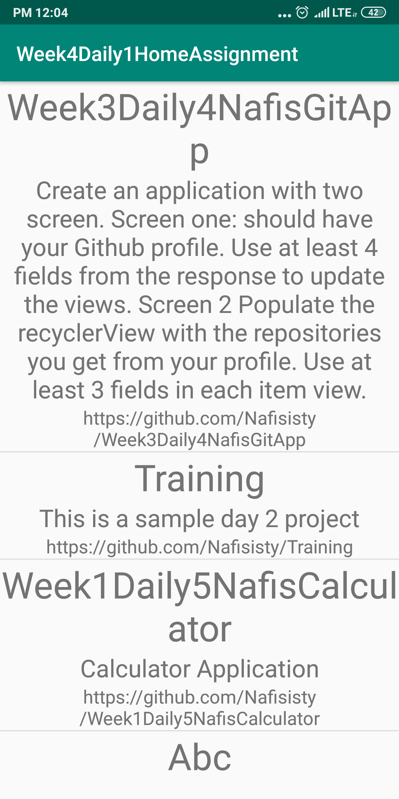

# Week4Daily1HomeAssignment
Create an application with two screen. Screen one should have your Github profile. Use at least 4 fields from the response to update the views. In screen two, populate the recyclerView with the repositories you get from your profile. Use at least 3 fields in each item view.

Profile of User

Repository List of User

